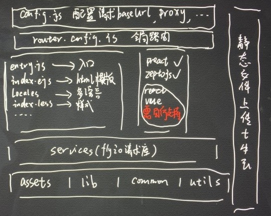

## 基于现代前端技术的多页框架（特别针对移动端端外优化）
专门为端外落地页面设计的框架，页面间独立，支持多语言，推荐使用框架内置preact开发，当然也可以使用别的技术栈。

## 快速开始
npm install  
npm run dev  
打开localhost:8008开始开发

## 构建
npm run build (build:test) 构建测试或者线上环境

## 项目架构

1. 复制src/pages/Example文件夹开启一个新页面
2. entry.js标识着每个页面的入口，名字不能改变
3. 路由写到configs/router.config.js里面
4. api写到services里
5. 资源文件（图片等）写到assets里
6. 公共文件写到common里
7. 多语言写到每个页面的locales文件夹里

## 最后
Have Fun！